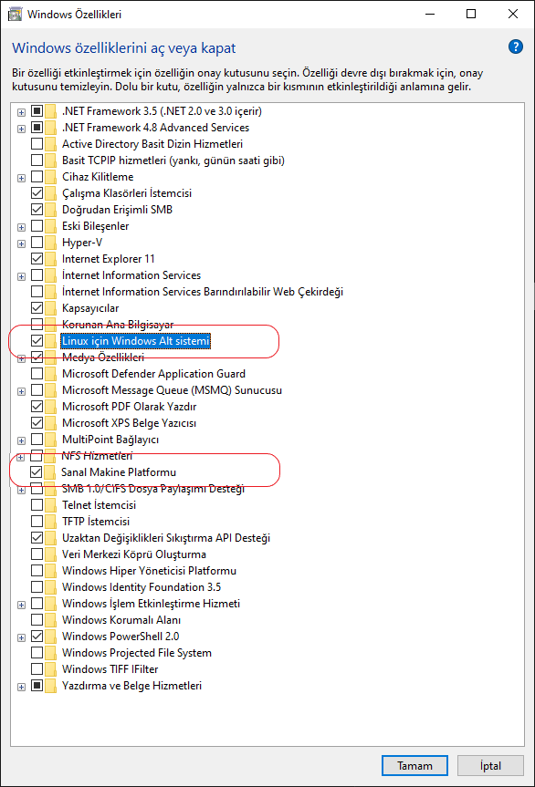
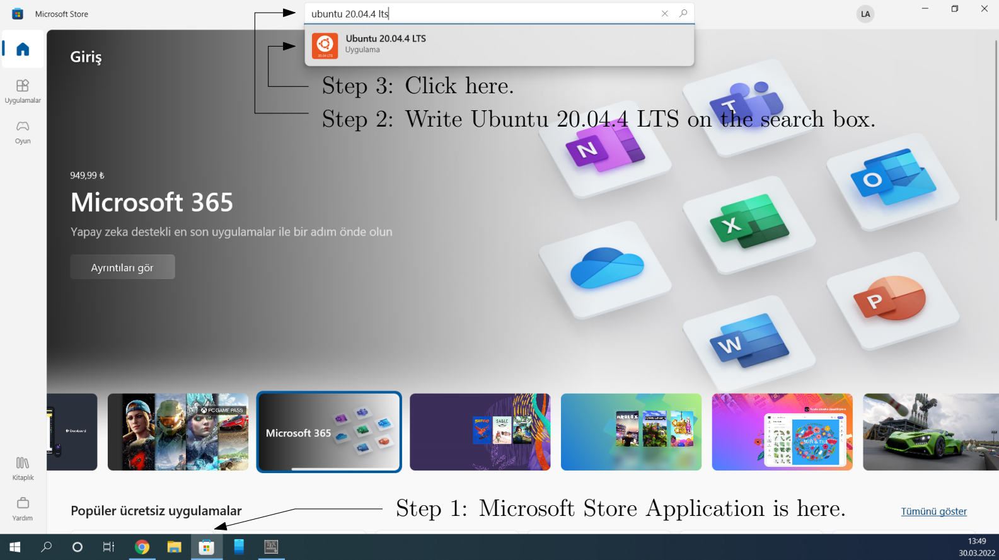
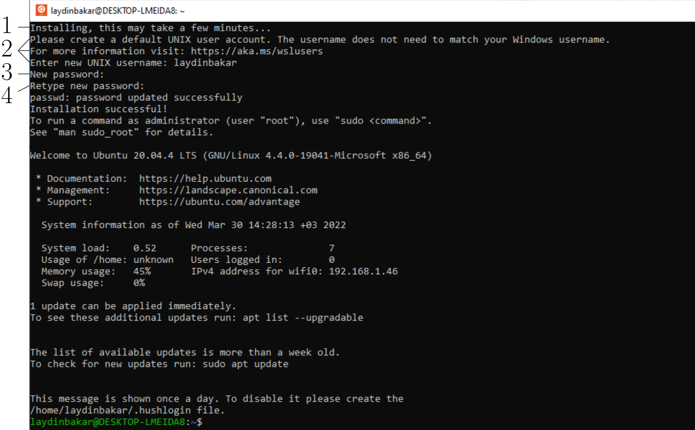
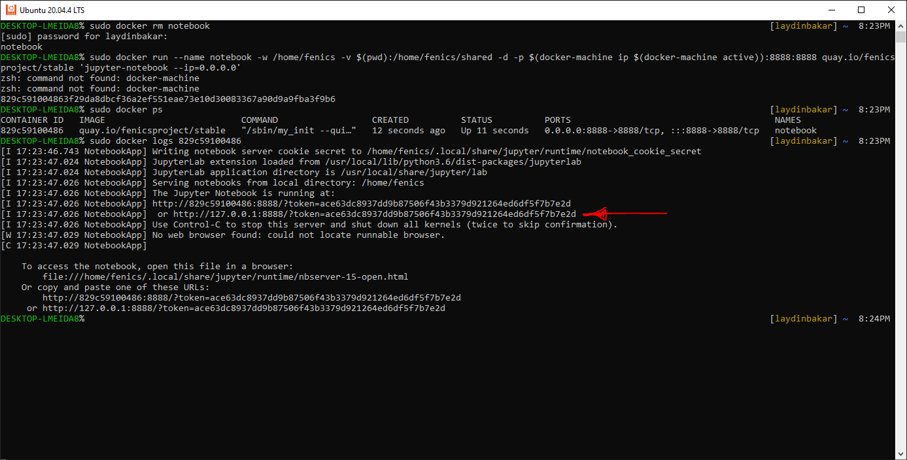

# FEniCS installation
This repository is for students of CFD and FEM Courses at Bursa Technical University to install FEniCS on their computers with Windows OS.

## Enabling WSL and VMP on Windows
First enable WSL and VMP (Sanal Makine Platformu). Search `Windows Ozelliklerini Ac veya Kapat` in TR characters from the Start menu and enable the `Linux icin Windows Alt sistemi` and `Sanal Makine Platformu` as follows:

Please note that this operation needs a root user authentication.


 
Restart your computer.

## Ubuntu 20.04.4 LTS on Windows
Install Ubuntu 20.04.4 LTS from the Microsoft store shown as follows:


Install Ubuntu 20.04.4 LTS. The terminal window will appear after the download process finishes.
Then it will show up the first line (1). Wait for a few minutes. Then the following three lines will appear
and Ubuntu asks you to name your installation (2). Finaly, you need to create a password (3) and (4)


## Update WSL to WSL2
To use FEniCS on Jupyter Notebook we need a newer version of WSL.
To update it, download file on [this link](https://wslstorestorage.blob.core.windows.net/wslblob/wsl_update_x64.msi) and install.
Then open Windows PowerShell and run the following commands:
```
wsl --set-default-version 2
wsl --set-version Ubuntu-20.04 2
wsl -l -v
```
Then you should see the output below:
```
NAME STATE VERSION
* Ubuntu -20.04 Running 2
```

## FEniCS on Docker
We use FEniCS on Jupyter Notebook using Docker. 
Open Ubuntu from the Start menu.
Use the following commands to install Docker on the Ubuntu Terminal.
```
sudo apt-get remove docker docker-engine docker.io containerd runc
sudo apt-get update
sudo apt-get install docker-ce docker-ce-cli containerd.io docker-compose-plugin
```
Now, you need to start a docker container daemon. Run
```
sudo dockerd
```
leave that terminal opened and open another one from the Start Menu, Ubuntu.
In the new terminal run:
```
sudo docker run --name notebook -w /home/fenics -v $(pwd):/home/fenics/shared -d -p $(docker-machine ip $(docker-machine active)):8888:8888 quay.io/fenicsproject/stable 'jupyter-notebook --ip=0.0.0.0'
```
This process will take for a while for the first time. It will download over 300 MB of FEniCS files.
Later, follow the figure below to open a Jupyter Notebook including FEniCS.

