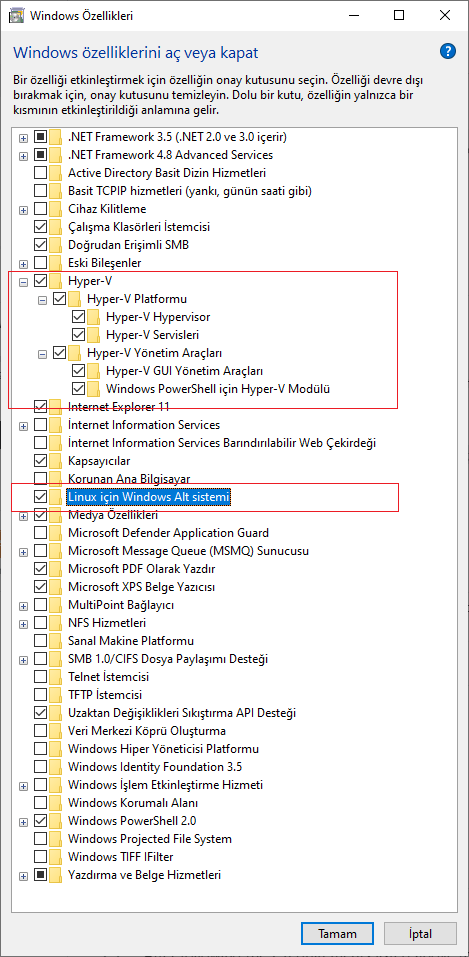

# FEniCS installation
This repository is for students of CFD and FEM Courses at Bursa Technical University to install FEniCS on their computers with Windows OS.

## Enabling WSL and Hypre-V on Windows
First enable WSL and Hypre-V. Search `Windows $(O)M(Bzelliklerini A$(O)](B veya Kapat` from the Start menu and enable the `Linux i$(O)](Bin Windows Alt sistemi` and all six options under `Hyper-V` as follows:

